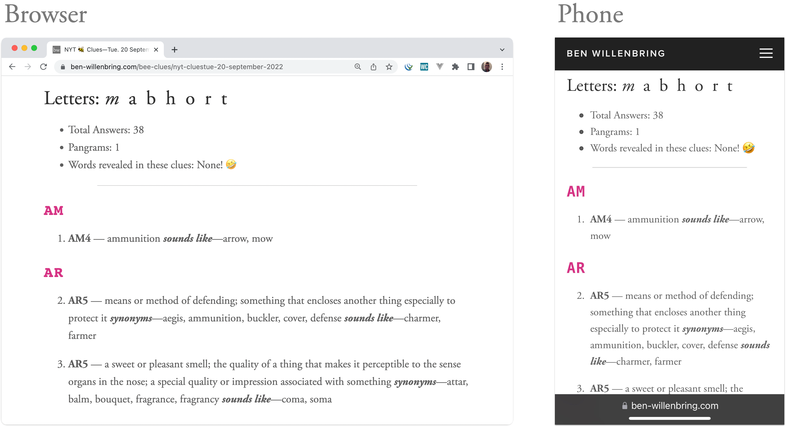

# nytimes-bee

-   Each day, checks the [New York Times spelling bee game](https://www.nytimes.com/puzzles/spelling-bee) for the newest puzzle
-   Gets all the answers—then for each answer:
    -   Generates clues using Merriam Webster's [dictionary api](https://www.dictionaryapi.com), and outputs as `json`
    -   Publishes the json to an AWS bucket
    -   Publishes the json (as html) to [ben-willenbring.com/bee-clues](https://ben-willenbring.com/bee-clues)

## Sample Clues

[View sample here](https://www.ben-willenbring.com/bee-clues/nyt-cluestue-22-august-2023).

